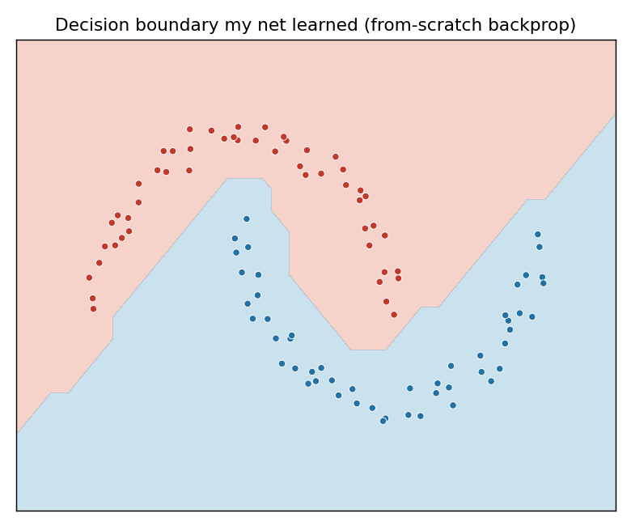

# Neural Network From Scratch

A working neural network and the automatic-differentiation engine that powers it,
written in pure Python. No PyTorch, no TensorFlow, no numpy in the core. About
200 lines total. It trains, with real backpropagation, on a problem a straight
line cannot solve, and gets it 100% right.



*The curved boundary the network discovered on its own. No straight line can
separate these two classes; backpropagation found the shape.*

## Why this exists

The point is not to compete with the big frameworks. It is to understand,
end to end, what "training a model" actually means. The same mechanism here,
forward pass, loss, backpropagation, gradient step, is what powers the models
behind modern AI. This is the small, readable version.

## The three files

| File | What it is |
|------|-----------|
| `engine.py` | The autograd engine. A `Value` wraps one number and remembers how it was computed, so `.backward()` walks the graph in reverse and computes gradients via the chain rule. This *is* backpropagation. |
| `nn.py` | A neural network (Neuron → Layer → MLP) built on top of those `Value`s. Just weighted sums, a nonlinearity, repeated. |
| `train.py` | Builds a two-moons dataset, trains the net, prints the loss falling and accuracy rising, and saves the decision-boundary image. |

## Run it

```bash
pip install -r requirements.txt   # numpy + matplotlib, for the plot only
python train.py
```

Output:

```
step   0   loss 0.77   acc 72%
step  20   loss 0.06   acc 98%
step  49   loss 0.02   acc 100%

Saved decision_boundary.png
```

The training itself needs no dependencies; numpy and matplotlib are only used to
draw the picture.

## What's actually happening

Training is a three-line idea in a loop:

1. **Forward** — run inputs through the net, measure how wrong it is (the loss).
2. **Backward** — call `.backward()` to compute, for every weight, how much it
   contributed to that wrongness (the gradient).
3. **Step** — nudge every weight a little in the direction that reduces the loss.

Repeat a few dozen times and random initial weights become a model that has
learned the shape of the data.

## Extending it

- Swap `tanh` for `relu` in `nn.py` and watch the boundary change.
- Make the data harder (more noise, a spiral instead of moons).
- Next step on this track: extend the engine into a tiny character-level language
  model (the nanoGPT path) to see the same idea applied to text.

---

Built in the spirit of Andrej Karpathy's `micrograd`, as a learning project to
understand model training from first principles.
